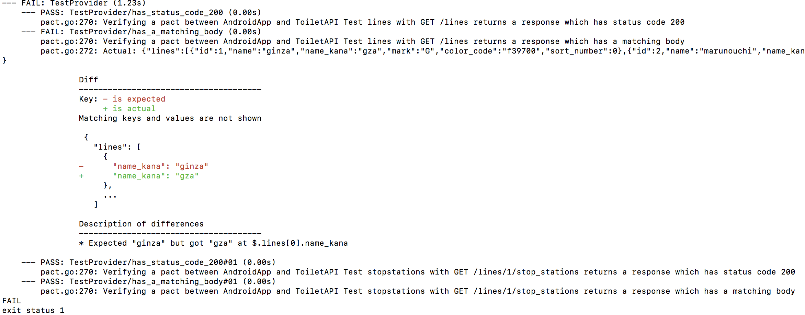
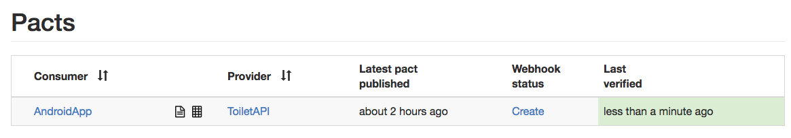
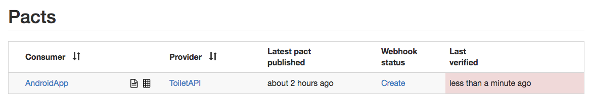
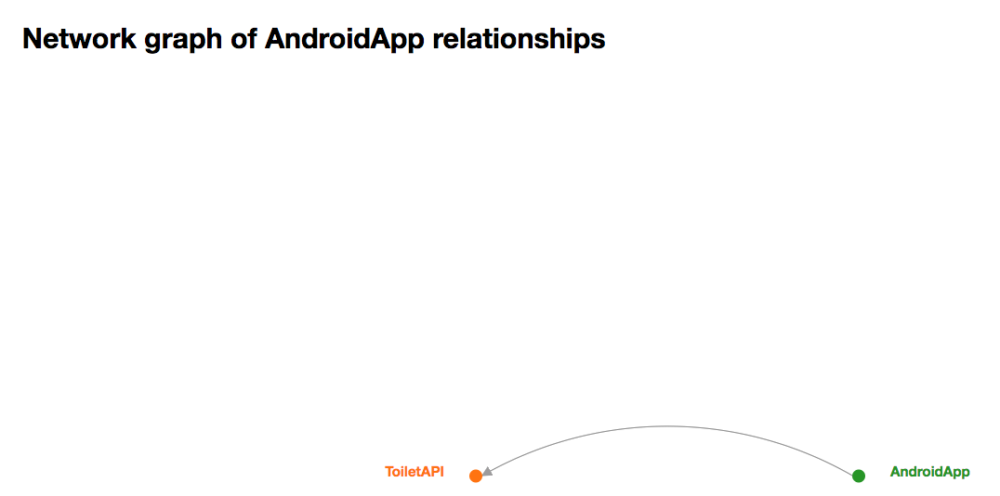
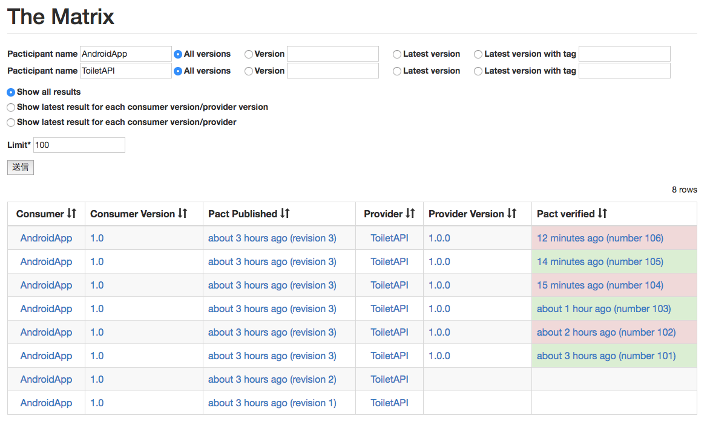

### go with pact

[@katsutomu](https://github.com/katsutomu)

---

### Pact is なにか
- Consumer Driven Contruct Testのimplements
- Pactファイルを介して消費者と提供者間の破壊的変更を検知する

---


### 手順-Provider

1. ConsumerからPactファイルをもらう
2. Pactファイルの内容を満たしてテストする

---


### Consumerテストコード
```
val pact = ConsumerPactBuilder.consumer("AndroidApp")
    .hasPactWith("ToiletAPI")
    .path("/lines")
    .method("GET")
    .willRespondWith()
    .status(200)
    .body({
      "lines": [
        {
          "id": 1,
          "name": "ginza",
          "name_kana": "ginza",
          "mark": "G",
          "color_code": "f39700",
          "sort_number": 0
        },
        {
          "id": 2,
          "name": "marunouchi",
          "name_kana": "marunouchi",
          "mark": "M",
          "color_code": "e60012",
          "sort_number": 0
        }
      ]
    })
    .toPact()
val config = MockProviderConfig.createDefault()
val result = runConsumerTest(pact, config, object : PactTestRun {
override fun run(mockServer: MockServer) {
  // ここにassertThatとか
}
})
Assert.assertEquals(PactVerificationResult.Ok, result);
```
@[1](自分の名前を指定)
@[2](対象のProviderを指定)
@[3-4](エンドポイントとHttpメソッドを指定)
@[5-27](期待するレスポンスを指定)
@[29-35](テストを実行)

---

### Pactファイル

```
{
    "provider": {
        "name": "ToiletAPI"
    },
    "consumer": {
        "name": "AndroidApp"
    },
    "interactions": [
        {
            "description": "test lines",
            "request": {
                "method": "GET",
                "path": "/lines"
            },
            "response": {
                "status": 200,
                "body": {
                    "lines": [
                        {
                            "id": 1,
                            "name": "ginza",
                            "name_kana": "ginza",
                            "mark": "G",
                            "color_code": "f39700",
                            "sort_number": 0
                        },
                        {
                            "id": 2,
                            "name": "marunouchi",
                            "name_kana": "marunouchi",
                            "mark": "M",
                            "color_code": "e60012",
                            "sort_number": 0
                        }
                    ]
                }
            }
        }
    ],
    "metadata": {
        "pact-specification": {
            "version": "2.0.0"
        },
        "pact-jvm": {
            "version": "3.5.0"
        }
    }
}
```
@[2-7](ConsumerとProviderの名前)
@[11-14](エンドポイントとHttpメソッド)
@[15-37](期待するレスポンス)

---

### Providerテストコード
```
	pact := &dsl.Pact{
		Port:     6666, // Ensure this port matches the daemon port!
		Consumer: "AndroidApp",
		Provider: "ToiletAPI",
	}

	go startServer()

	pact.VerifyProvider(t, types.VerifyRequest{
		ProviderBaseURL:        "http://localhost:8080",
		BrokerURL:              "http://localhost",
		ProviderStatesSetupURL: "http://localhost:8080/setup",
		BrokerUsername:         "",
		BrokerPassword:         "",
		PublishVerificationResults: true,
		ProviderVersion:            "1.0.0",
	})

```
@[1-5](Pact　deamonに接続)
@[7](テスト対象のAPIを起動)
@[9-17](テストを実行)
@[12](/setUpにリクエストがきてデータを入れ替える)

---

### データsetUp
```
rest.Post("/setup", func(w rest.ResponseWriter, r *rest.Request) {
        var s *types.ProviderState

        decoder := json.NewDecoder(r.Body)
        decoder.Decode(&s)

        db, err := sql.Open("mysql", user+":"+pass+"@tcp(192.168.33.200:3306)/"+dbName)
        if err != nil {
                log.Fatal(err)
        }
        fixtures, err := testfixtures.NewFolder(db, &testfixtures.MySQL{}, "fixtures")
        if err != nil {
                log.Fatal(err)
        }
        if err := fixtures.Load(); err != nil {
                log.Fatal(err)
        }
        w.Header().Add("Content-Type", "application/json")
})
```
@[4-5](リクエストボディにComsumer名や状態が入っている)
@[7](テスト対象のAPIを起動)
@[11-17](Consumerごとにfixtureを入れ替えられる)

---

### fixture
```
- id: 1
  name: ginza
  name_kana: ginza
  mark: G
  color_code: f39700
  sort_number: 0

- id: 2
  name: marunouchi
  name_kana: marunouchi
  mark: M
  color_code: e60012
  sort_number: 0
```
---

### 失敗すると


---


### ここまでまとめ
- PactファイルをConsumerが作る
- ProviderがPactファイルを元にテストする
- 仲介役はPactBrocker


### PactBroker
1. pactファイルの仲介役
2. テストの結果履歴を管理
3. その他にもお得機能あり

---


---

---


---
### 所感
- 各サービス間を緩く繋いで破壊的変更を検知できて安心
- GraphQL,Swagger,gRPC　with Protocolとかあるのでそちらで乗り切ってもう良さそう
- PactBrockerのメリットは高いかも

---
### ご静聴ありがとうございました


### 資料など
- http://techlife.cookpad.com/entry/2016/06/28/164247
- http://blog.soushi.me/entry/2017/01/28/215229
- https://github.com/pact-foundation/pact-go
- https://github.com/DiUS/pact-jvm
- https://github.com/DiUS/pact_broker-docker
